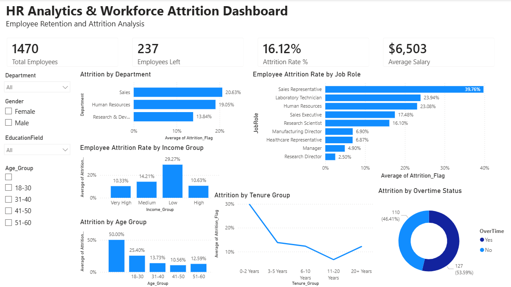
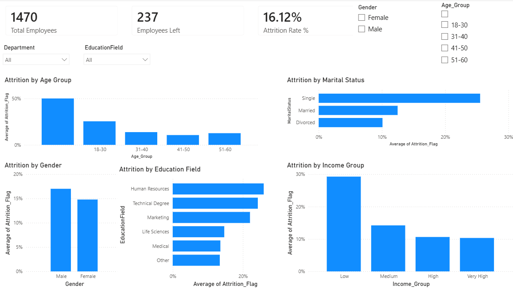
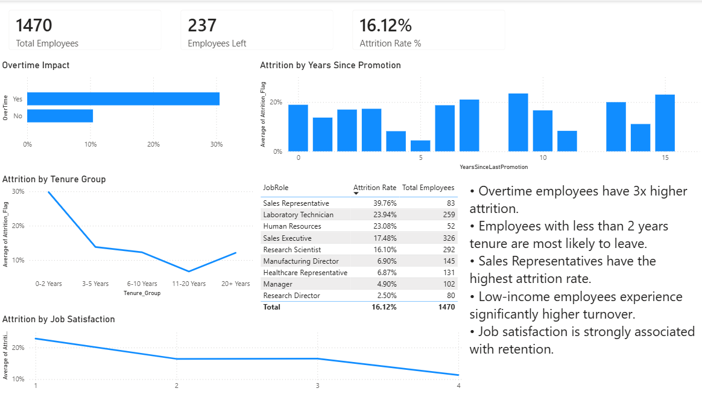

# HR Analytics & Workforce Attrition Dashboard


## Project Overview

This project analyzes employee attrition patterns using Python, SQL Server, and Power BI. The objective is to identify the key factors driving employee turnover and provide actionable insights to improve workforce retention.

The analysis covers employee demographics, compensation, job satisfaction, overtime, tenure, and job roles to uncover trends associated with attrition.

---

## Business Problem

Employee attrition can significantly impact productivity, hiring costs, and organizational performance. HR teams need data-driven insights to understand:

*   Which employees are most likely to leave
*   Which departments experience the highest turnover
*   How compensation affects retention
*   Whether overtime contributes to attrition
*   How employee satisfaction and tenure influence turnover

This project provides an interactive dashboard to support workforce planning and retention strategies.

---

## Dataset

*   **Source:** IBM HR Analytics Employee Attrition Dataset
*   **Total Employees:** 1,470
*   **Features:** 35+ employee attributes
*   **Target Variable:** Attrition (Yes/No)

### Key Fields
Age, Department, JobRole, MonthlyIncome, Gender, MaritalStatus, EducationField, JobSatisfaction, OverTime, YearsAtCompany, Attrition.

---

## Tools & Technologies

*   **Python:** Pandas, NumPy, Matplotlib, Seaborn
*   **SQL:** SQL Server Management Studio (SSMS 22), CTEs, Window Functions, CASE Statements, Aggregations
*   **Business Intelligence:** Power BI, DAX Measures, Interactive Dashboards, KPI Cards, Slicers
*   **Version Control:** Git, GitHub

---

## Project Workflow

### 1. Data Cleaning & Feature Engineering
Performed data preparation using Pandas:
*   Checked and validated missing values
*   Removed duplicate records
*   Created `Attrition_Flag` (0/1)
*   Created Age Groups, Income Groups, and Tenure Groups
*   Exported cleaned dataset for SQL and Power BI

### 2. Exploratory Data Analysis (EDA)
Analyzed employee attrition across Departments, Job Roles, Income Groups, Age Groups, Gender, Job Satisfaction, Overtime Status, and Tenure Groups.

### 3. SQL Analysis
Performed business-focused analysis using SQL Server. Key SQL concepts demonstrated: `GROUP BY`, `CASE WHEN`, Aggregate Functions, Common Table Expressions (CTEs), Window Functions, `RANK()`.

**Example analyses:**
*   Overall Attrition Rate
*   Attrition by Department, Job Role, Income Group, and Tenure
*   Workforce Ranking by Department
*   High-Risk Employee Roles

---

## Power BI Dashboard

The project includes a multi-page Power BI solution.

### Page 1: Executive Overview
Provides a high-level summary of workforce attrition.
*   **KPIs:** Total Employees, Employees Left, Attrition Rate %, Average Salary
*   **Visuals:** Attrition by Department, Job Role, Income Group, Age Group, Tenure Group, Overtime Impact

### Page 2: Workforce Demographics
Focuses on employee demographics and turnover.
*   **Visuals:** Attrition by Age Group, Gender, Marital Status, Education Field, Income Group

### Page 3: Retention Risk Analysis
Identifies the primary drivers of attrition.
*   **Visuals:** Overtime Impact, Attrition by Tenure Group, Job Satisfaction, Years Since Promotion, High-Risk Job Role Analysis

---

## Executive Findings Panel

### Key Findings

*   **Overtime is the strongest attrition driver:** Employees working overtime experienced an attrition rate of approximately **30.5%**, compared to **10.4%** for employees who did not work overtime.
*   **Low-income employees leave more frequently:** Employees in the lowest income segment exhibited an attrition rate of approximately **29%**, nearly three times higher than top earners.
*   **Early-career employees are at highest risk:** Employees aged 18–30 experienced the highest attrition rate at approximately **25%**.
*   **Attrition is highest during the first two years:** Employees with less than two years of tenure showed an attrition rate close to **29%**.
*   **Job satisfaction strongly influences retention:** Employees with low satisfaction scores left at nearly double the rate of highly satisfied employees.
*   **Sales roles experience the highest turnover:** Sales Representatives recorded the highest attrition rate at approximately **40%**.

---

## Business Recommendations

Based on the analysis:
1.  **Reduce excessive overtime** through workload balancing and staffing optimization.
2.  **Review compensation strategies** for lower-income employee groups.
3.  **Strengthen onboarding and engagement programs** for employees within their first two years.
4.  **Monitor employee satisfaction** through regular surveys and feedback initiatives.
5.  **Develop targeted retention strategies** for high-risk sales positions.

---

## Dashboard Screenshots

### Executive Overview


### Workforce Demographics


### Retention Risk Analysis


---

## Project Structure

```text
hr-analytics-attrition-dashboard/
├── dashboard_screenshots/
│   ├── executive_overview.png
│   ├── retention_risk_analysis.png
│   └── workforce_demographics.png
├── data/
├── notebooks/
│   └── HR_Data_Cleaning.ipynb
├── powerbi/
├── sql/
│   └── hr_analysis.sql
├── venv/
├── README.md
└── requirements.txt

Author
Adarsh

Aspiring Data Analyst focused on Python, SQL, Power BI, and business intelligence projects.